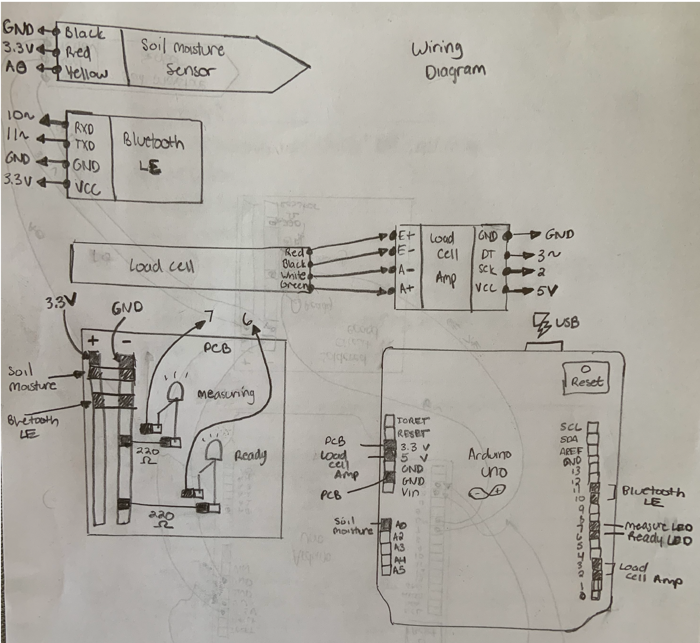

# SoilBright
## Overview
SoilBright is a sensor developed for detecting soil moisture and density. 
There are two parts to SoilBright:
- Soil Sensor - Arduino
- Soil App - IOS

## Soil Sensor
The soil sensor itself uses the following schematic:

The critical pieces used are:
- Soil Moisture Sensor
- BLE Module
- Load Cell
- Load Cell Amp
- Arduino Uno

When these are constructed, you can use the C++ code found in Arduino/SoilBright/ to upload the code using the Arduino IDE.

## IOS App
The source code for the IOS App is found in SoilBright/. Due to the cost of hosting IOS Applications, this app has been discontinued from the App Store.

Nevertheless, you should be able to drag and drop the source code into XCode and run it using your own iPhone or iPad.

## Paper
The accompanying paper can be found here:
